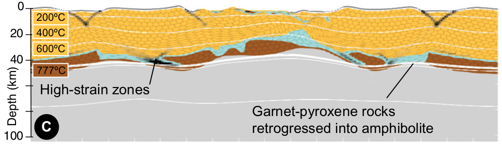

<table><tr>
  <td></td>
  <td></td>
  </tr></table>

https://doi.org/10.1130/G47301.1

Abstract
-----
Away from tectonically active regions, the continental crust has an average thickness of
40 ± 1 km. Yet, it shows a remarkable variability from 25 to 65 km, comparable to that of
the most tectonically active regions. Here, we consider the problem of the formation and
preservation of anomalous deep crustal roots in stable intracontinental regions. Using two-
dimensional thermomechanical experiments, we show that the interplay between partial
melting, the formation of garnet-pyroxene-bearing rocks, and their strain rate–dependent
retrogression result in the preservation of thick and strong crustal roots. We argue that it
is the partitioning into narrow regions of strain, retrogression, and weakening coupled into
a positive feedback loop that explains why strong high-grade crustal roots remain largely
immune to gravitational stresses and are able to persist over hundreds of millions of years.

Files
-----
**_Please give a quick overview of purpose of the model files/directories included in this repo._**
**_Note that while light data files are fine,  heavy data should not be included in your repository._**

File | Purpose
--- | ---
`Script-G47301_285-Cenki-Tok-etal-1.ipynb` | Input file script.
`media/FigC.png` | Configuration C, after 25% extension.
`media/GeolMov.gif` | Evolution of the model.

Tests - todo
-----

Parallel Safe
-------------
Yes
